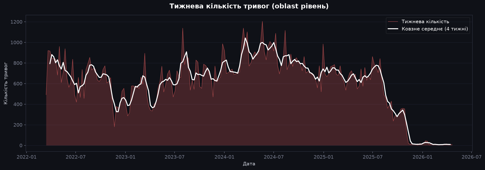
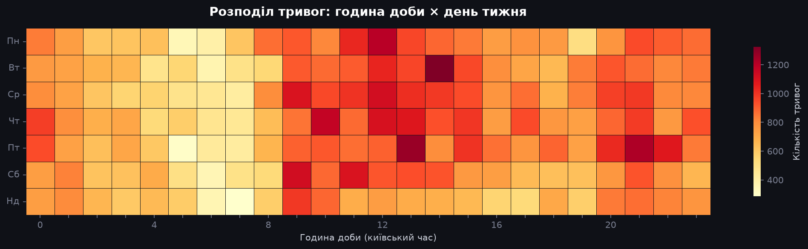
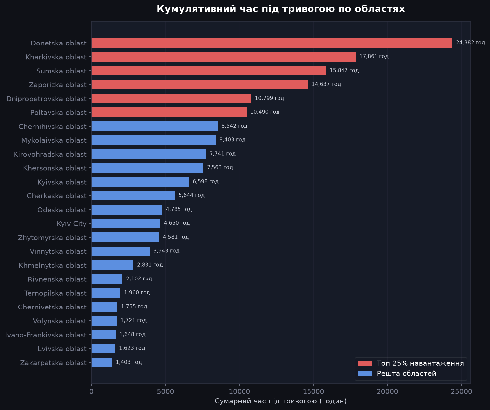
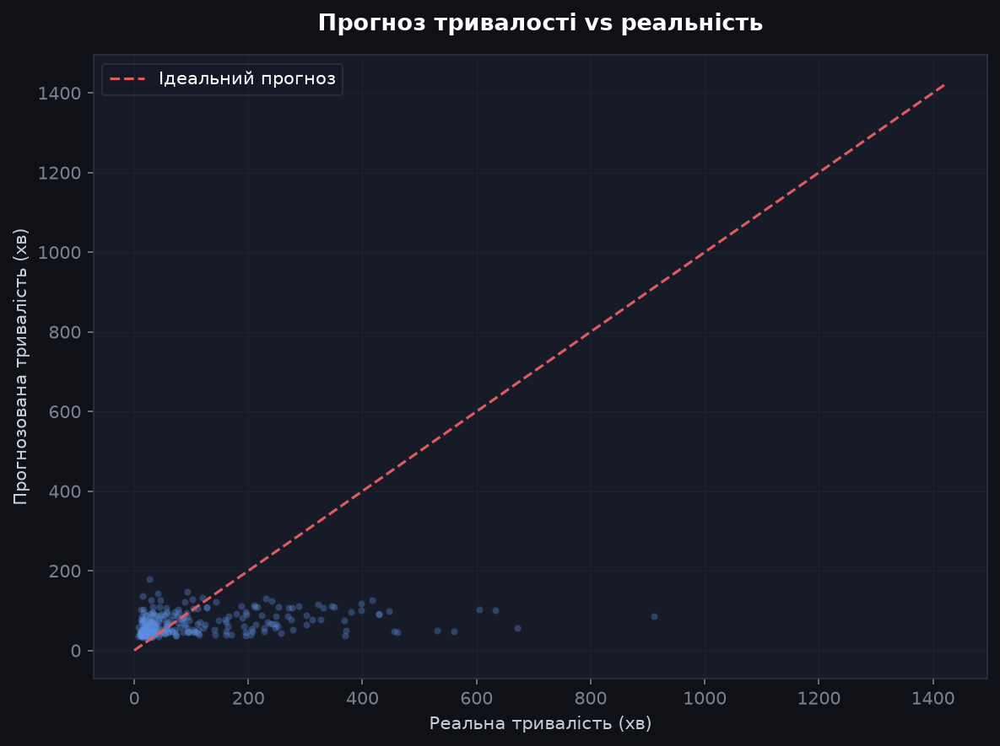
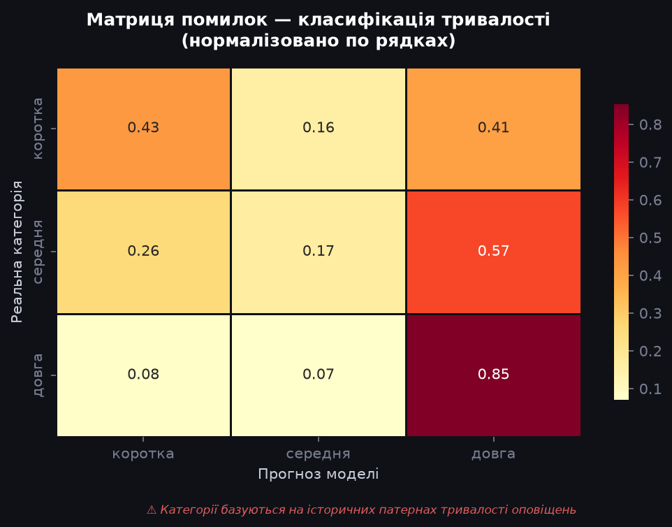
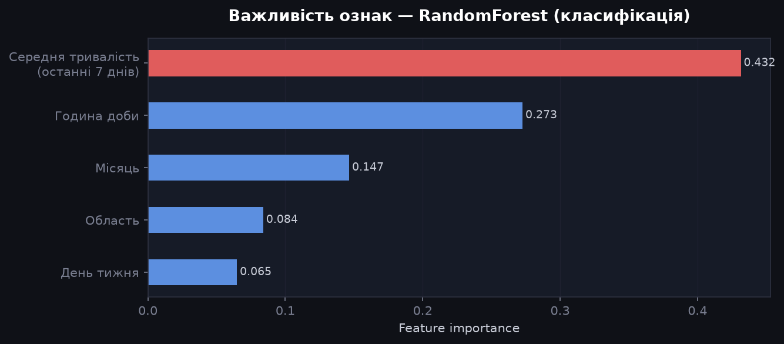
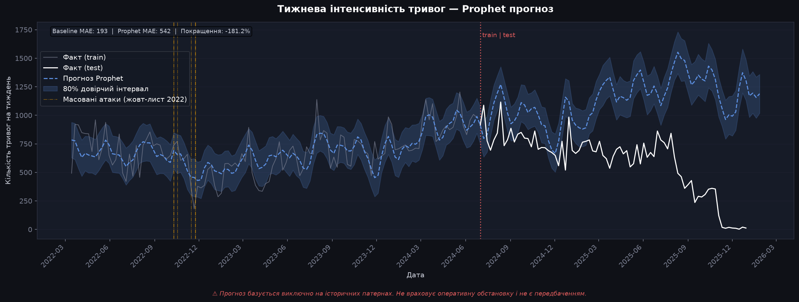
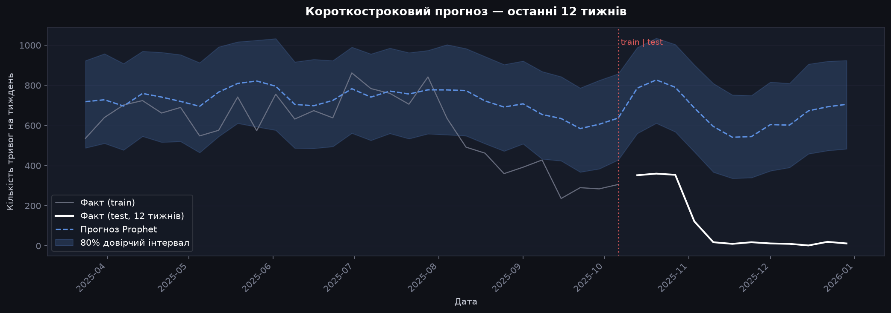

# -TSAofAirRaidAlerts

Цей проєкт був створений одним учнем за 2 дні. Аналіз часових рядів повітряної тривоги в Україні дав мені можливість створити міні-прогноз наступних тривог, оснований на патернах минулих тривог.

## Датасет

Я використав публічно доступний датасет, створений користувачем Vadimkin, який охоплює дані тривог з 2022-03-15 по 2026-06-21, але через обмеження платформи GitHub на розмір файлу, мені довелось прибрати деякі дані, тому вибірка скоротилась до періоду з 2022-03-15 до 2026-04-25.

Copyright (c) 2022 Vadym Klymenko

(Зауваження: на деяких графіках дані за 2026 рік можуть бути не зовсім коректними, у зв'язку зі зміною системи оповіщень з областей на області&райони&громади)

## Аналіз готового датасету

За допомогою початкових даних, було зроблено такі графіки:

Графік тижневої інтенсивності повітряних тривог (дані за 2026 рік вказані не зовсім коректно)

Розподіл частоти повітряних тривог за періодом доби та тижня (найчастіше значення - 13.00, Четвер)

Рейтинг областей за найбільшою тривалістю тривоги в ній

## Знаходження патернів

Ідеальний прогноз та реальність

## Прогноз

Як відрізняються значення прогнозу тривалості тривоги від реальних значень

Основні чинники при формуванні прогнозу тривоги

Довгостроковий прогноз тривоги за складнішою моделлю Prophet

Короткостроковий прогноз тривоги за складнішою моделлю Prophet

## Підсумки

Простіша модель Baseline виявилась ефективнішою, за складнішу модель Prophet. Було вияснено, що прозноз тривоги будується не лише на статистичних даних, а в основну чергу від зовнішніх чинників, які у датасеті не вказані. Повний звіт ви можете прочитати у файлі outputs/reports/summary.txt

